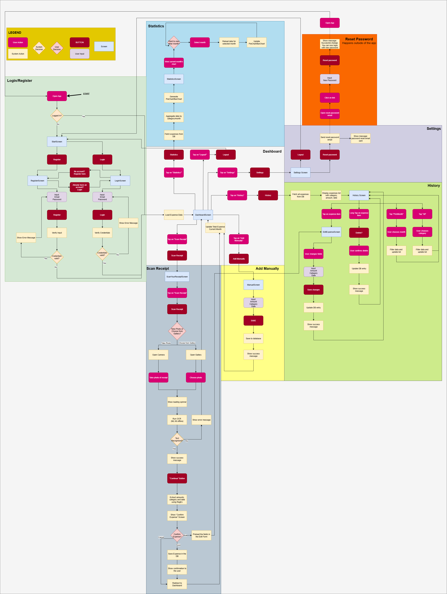

# 🧾 Receipt Tracker

**University**: Hochschule für Wirtschaft und Recht Berlin

**Module:** App Development in Android – Summer Semester 2025  
**Professor:** Holger Zimmermann  

**Submission Date:** 16 August 2025  
**Author:** Denis Cercasin (77212023470)

---

## Goal

The aim of this project is to design and implement a fully functional Android application that enables users to scan receipts, automatically detect expense amounts, categorize spending, and analyze expenses through visual statistics.  
This project fulfills the requirements of the module by integrating multiple functionalities, Firebase database, user authentication, and a clean, user-friendly interface.

---

## Description

**Receipt Tracker** is an Android application that helps users manage their expenses efficiently.  
The app uses **ML Kit’s offline OCR** to extract text from scanned receipts, detects amounts via **regular expressions**, and assigns categories automatically using keyword logic.  
All data is stored remotely using **Firebase Firestore** and can be viewed in detailed monthly statistics with **MPAndroidChart** visualizations.

**Main Features:**
- **Receipt Scanning:** Use the device camera to capture receipts.
- **Offline OCR Recognition:** ML Kit’s on-device text recognition extracts amounts without an internet connection.
- **Automatic Categorization:** Assigns categories (e.g., Groceries, Fuel) based on keywords.
- **Remote Storage:** Firebase Firestore ensures secure and synchronized data storage.
- **Statistics Dashboard:** Pie chart & bar chart views of expenses per month.
- **Manual Entry:** Add expenses without scanning.
- **Login & Registration:** Secure user authentication.

---

## Contributor

- Denis Cercasin – Developer

---

## Target Users & Background Motivation

While there are many similar expense tracking apps, Receipt Tracker was designed with a specific target group in mind:  
citizens of **Moldova, Romania, and Ukraine**.  

Unlike Western European countries, these regions do not have many widely recognized, Europe-wide retail chains.  
This app’s categorization and keyword recognition system is planned to be tailored for local shop names and receipt formats.  

For testing and academic submission purposes, the current version is adapted for Germany.  
In future iterations, it will be localized to meet the needs of the originally intended markets.

---

## Scope

| Feature | Status |
|---------|--------|
| Login / Register | ✅ |
| Camera-based receipt scan | ✅ |
| OCR text extraction (offline) | ✅ |
| Automatic amount & category detection | ✅ |
| Manual expense entry | ✅ |
| Firebase Firestore storage | ✅ |
| Monthly statistics with charts | ✅ |
| Expense history list | ✅ |
| Edit / Delete expenses | ✅ |

---

## How to Run

### Option 1 – Run from Source (Android Studio)
1. **Clone this repository**
   ```bash
   git clone https://github.com/yourusername/receipt-tracker.git
   ```
2. **Open in Android Studio**
- **File → Open** → Select the cloned project folder.

3. **Sync Gradle**
- Let Android Studio download all dependencies automatically.

4. **Build & Run**
- Connect an Android device or start an emulator.  
- Click ▶ Run in Android Studio.

5. **Requirements**

- Android Studio
- SDK 33–35  
- Internet connection for first run (for dependencies)  
- Camera permission enabled

### Option 2 – Install via APK

1. Go to the [`/apk`](apk/) folder in this repository.  
2. Download the latest `.apk` file to your Android device.  
3. Enable installation from unknown sources (if prompted).  
4. Install and launch the app.

---

## First-Time Usage Notes

If you are running the app for the **first time** on an emulator, please note the following:

1. **Camera Permission**  
   - When you try to scan a receipt for the first time, the app may show a message that it has no permission to access the camera.  
   - Usually, there will be a "Go to Settings" button in the message. Tap it, grant "Allow while using the app" permission, then return to the app.  
   - Press **Scan Receipt** again – it should now work.

2. **Test Receipts Provided**  
   - The repository contains a folder [`/test_receipts`](test_receipts/) with 3 AI-generated sample receipts you can use for testing.
   - These receipts are dated July, so when scanned, the ML Kit will correctly recognize them as July expenses.  
   - Important: Since the dashboard shows totals for the current month, scanning July receipts will not change the current month’s balance. You can still verify they are saved correctly in the History view.

3. **Scanning a Receipt – Photo or Gallery**  
   - When tapping **Scan Receipt**, you can either:
     - Take a photo using the camera, or
     - Choose from gallery.
   - On a **new emulator**, the gallery will likely be empty.

4. **Adding Images to Emulator Gallery**  
   - Open the gallery app inside the emulator.  
   - Drag and drop a test receipt image (from `/test_receipts`) into the emulator window.  
   - The image will appear in the emulator’s Downloads folder.  
   - Go back to the app → press "Scan Receipt" → choose "From Gallery" → navigate to "Browse → Downloads" to select the image.

5. **Password Reset Emails**  
   - If you use the password reset feature, please check your Spam/Junk folder as the email might be filtered there.

---

## System Workflow (Sequence Diagram)

To illustrate the detailed flow of user interactions and system operations, a sequence diagram has been prepared for this project.

- **Formats available:**
  - [View PNG](docs/sequence_diagram.png) – Quick preview
  - [Download SVG](docs/sequence_diagram.svg) – Scalable vector format for detailed inspection

**Embedded Preview (PNG):**


The diagram covers:
- User authentication (login/register)
- Receipt scanning process (camera or gallery)
- OCR text extraction and amount parsing
- Category assignment logic
- Data storage in Firebase Firestore
- Display in history and statistics screens

---

## Next Ideas

- Cloud synchronization for multi-device usage with user-specific settings.
- Export expense reports to PDF or CSV.
- AI-powered category detection using a trained machine learning model.
- Budget alerts when monthly spending exceeds a predefined limit.
- Multi-language UI support (German, Romanian, Ukrainian, Russian).

---

## Limitations

- Current testing version is adapted for German receipts and keywords; localization for Moldova, Romania, and Ukraine is planned.
- OCR accuracy may vary depending on receipt quality, font, and lighting conditions.
- Category detection relies on keyword matching and may require user corrections.
- Remote storage requires an internet connection; offline-only mode is not yet supported.

---

## License

This project was developed for **educational purposes** at the  
Hochschule für Wirtschaft und Recht Berlin – Department of Computer Science.  

**No commercial use intended.**
